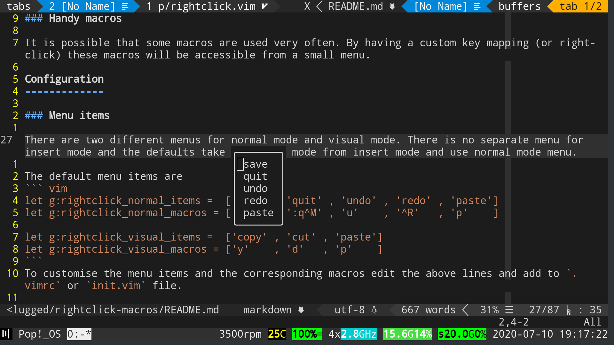

rightclick-macros
=================

**rightclick-macros** is a plugin for Neovim and Vim. The main goal is to get a text based menu in terminal (Neo)Vim at the location where user does a right-click with mouse. And then can select any of the options similar to any right-click menu in a GUI programs. Each option runs the corresponding macro in normal or visual mode.



Screenshot when mouse right-clicked on letter 'n' in the word 'normal'.

Use cases
---------
### Mouse

>I want my colleagues to be able to work along with me on the same computer at the same time. If they want to do something, I don't want them to try, fail and ask me to do it.

Usually there is no need to use the mouse wile using vim. But having a mouse functionality will help the beginners to make the learning wall less steep.

When working with different programs with mouse, there is no need to switch to keyboard for working in vim window.

When someone usually don't use vim but is stuck with it in SSH sessions.

But this is not the case with Vim. Popups in Vim cannot be selected with mouse because they are non focusable whereas in Neovim these menus are separate windows that can be focussed (so mouse can be used).

### Handy macros

It is possible that some macros are used very often. By having a custom key mapping (or right-click) these macros will be accessible from a small menu. Visual mode macros are run in the same way as normal mode but after running `gv` to select the previously selected text. This is because when the menu appears, the visual selection is lost.

Configuration
-------------

### Menu items

There are two different menus for normal mode and visual mode. There is no separate menu for insert mode and the defaults take to normal mode from insert mode and use normal mode menu.

The default menu items are
``` vim
let g:rightclick_normal_items =  ['save' , 'quit' , 'undo' , 'redo' , 'paste']
let g:rightclick_normal_macros = [':w^M' , ':q^M' , 'u'    , '^R'   , 'p'    ]

let g:rightclick_visual_items =  ['copy' , 'cut' , 'paste']
let g:rightclick_visual_macros = ['y'    , 'd'   , 'p'    ]
```
To customise the menu items and the corresponding macros edit the above lines and add to `.vimrc` or `init.vim` file.

**Important note:** While editing macros, give literal characters for buttons like `<Enter>`, `<Esc>`, `<C-r>` etc. To insert a literal character while typing press Ctrl-v and the key. For example, for literal character of Ctrl-r press Ctrl-v and then Ctrl-r. The literal characters will be displayed differently like *^M* for enter and *^R* for Ctrl-r (see above). **Do NOT copy paste the above lines directly**, type them yourself with the literal characters.


### Mappings

The default settings that will be set by plugin are
``` vim
set mouse=a
set mousemodel=popup
```
`mouse=a` is set to have a mouse support similar to GUI programs. `mousemodel=popup` is set to not have the right-click drag option.

To disable these configurations add the following line to `.vimrc` or `init.vim` file.
``` vim
let g:rightclick_default_config = 0
```


The default mappings are
``` vim
nnoremap <silent> <RightMouse> <LeftMouse>:call Rightclick_normal()<CR>
inoremap <silent> <RightMouse> <Esc>:call Rightclick_normal()<CR>
vnoremap <silent> <RightMouse> <LeftMouse>:call Rightclick_visual()<CR>
nnoremap <LeftMouse> <LeftMouse>i
```
Insert mode mappings just takes you to normal mode and shows the normal mode menu. `<LeftMouse>` mapping takes you to insert mode with cursor at location of left-click.

To disable these default mappings add the following line to `.vimrc` or `init.vim` file.
``` vim
let g:rightclick_default_mappings = 0
```
Custom mappings can defined such that they call the functions `Rightclick_normal()` and `Rightclick_visual()`. For example, to use a keyboard shortcut to get the menus add the following mappings to `.vimrc` or `init.vim` files.
``` vim
nnoremap <Leader>m :call Rightclick_normal()<CR>
vnoremap <Leader>m :call Rightclick_visual()<CR>
```
With custom keyboard mappings this plugin can be used just to run the macros when required without touching the mouse. This can be handy when any macros are used often.

### Neovim boarders

In Neovim, the boarders are made of special fonts. If there is any problem in displaying them then add the following lines in `.vimrc` or `init.vim` to overwrite the default characters.
``` vim
let g:rightclick_nvim_boarder_nw = "."
let g:rightclick_nvim_boarder_ne = "."
let g:rightclick_nvim_boarder_sw = "'"
let g:rightclick_nvim_boarder_se = "'"
let g:rightclick_nvim_boarder_h  = "-"
let g:rightclick_nvim_boarder_v  = "|"
```
